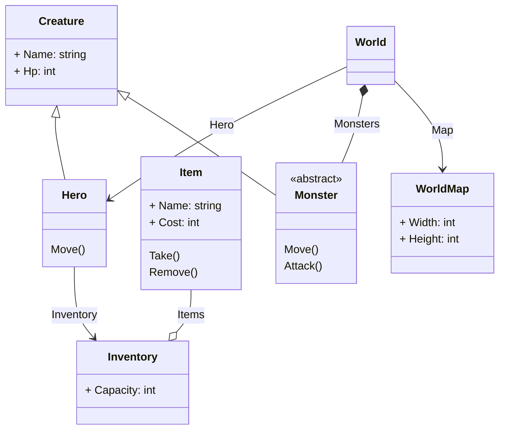

```mermaid
classDiagram
    class WorldMap {
        + Width: int
        + Height: int
    }

    class Creature {
        + Name: string
        + Hp: int
    }
    
    class Item {
        + Name: string
        + Cost: int
        Take()
        Remove()
    }

    class Hero {
        Move()
    }

    class Monster {
        <<abstract>>
        Move()
        Attack()
    }

    class Inventory {
        + Capacity: int
    }

    Creature <|-- Hero
    Creature <|-- Monster

    Hero --> Inventory : Inventory
    Item --o Inventory : Items

    World --> Hero : Hero
    World *-- Monster : Monsters
    World --> WorldMap : Map
```